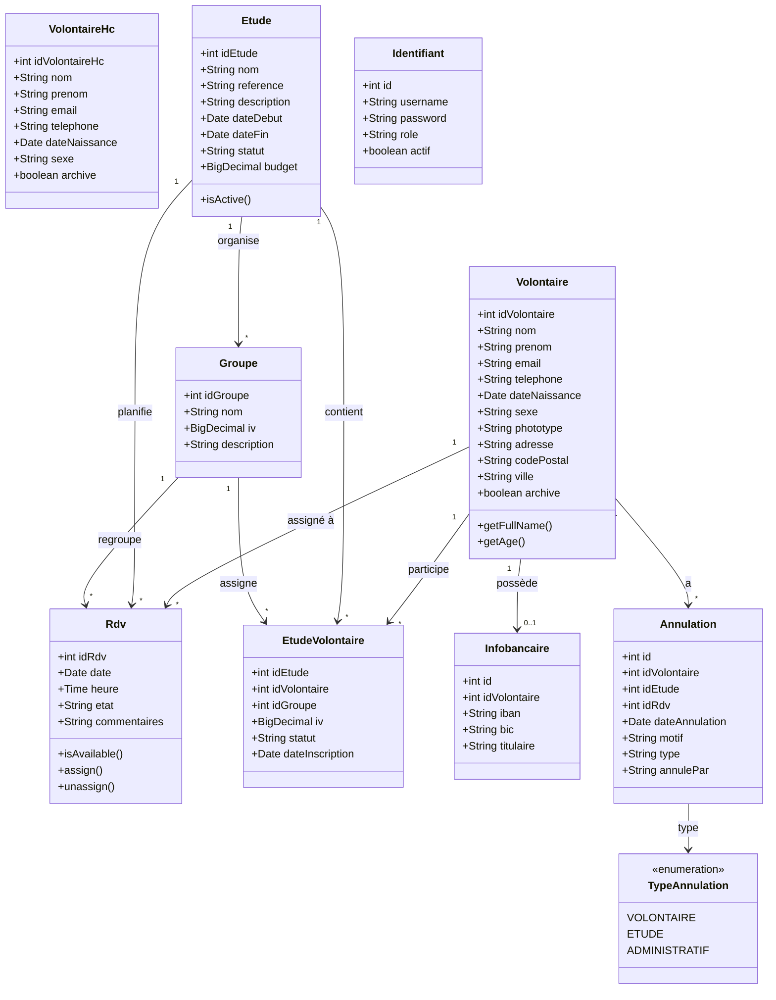

# Diagramme de Classes

```mermaid
classDiagram
    class Volontaire {
        +int idVolontaire
        +String nom
        +String prenom
        +String email
        +String telephone
        +Date dateNaissance
        +String sexe
        +String phototype
        +String adresse
        +String codePostal
        +String ville
        +boolean archive
        +getFullName()
        +getAge()
    }

    class VolontaireHc {
        +int idVolontaireHc
        +String nom
        +String prenom
        +String email
        +String telephone
        +Date dateNaissance
        +String sexe
        +boolean archive
    }

    class Etude {
        +int idEtude
        +String nom
        +String reference
        +String description
        +Date dateDebut
        +Date dateFin
        +String statut
        +BigDecimal budget
        +isActive()
    }

    class Rdv {
        +int idRdv
        +Date date
        +Time heure
        +String etat
        +String commentaires
        +isAvailable()
        +assign()
        +unassign()
    }

    class Groupe {
        +int idGroupe
        +String nom
        +BigDecimal iv
        +String description
    }

    class EtudeVolontaire {
        +int idEtude
        +int idVolontaire
        +int idGroupe
        +BigDecimal iv
        +String statut
        +Date dateInscription
    }

    class Infobancaire {
        +int id
        +int idVolontaire
        +String iban
        +String bic
        +String titulaire
    }

    class Annulation {
        +int id
        +int idVolontaire
        +int idEtude
        +int idRdv
        +Date dateAnnulation
        +String motif
        +String type
        +String annulePar
    }

    class TypeAnnulation {
        <<enumeration>>
        VOLONTAIRE
        ETUDE
        ADMINISTRATIF
    }

    class Identifiant {
        +int id
        +String username
        +String password
        +String role
        +boolean actif
    }

    %% Relations Volontaire
    Volontaire "1" --> "*" EtudeVolontaire : participe
    Volontaire "1" --> "*" Rdv : assigné à
    Volontaire "1" --> "0..1" Infobancaire : possède
    Volontaire "1" --> "*" Annulation : a

    %% Relations Etude
    Etude "1" --> "*" EtudeVolontaire : contient
    Etude "1" --> "*" Rdv : planifie
    Etude "1" --> "*" Groupe : organise
    %% Relations Groupe
    Groupe "1" --> "*" Rdv : regroupe
    Groupe "1" --> "*" EtudeVolontaire : assigne

    %% Relations Annulation
    Annulation --> TypeAnnulation : type

```
