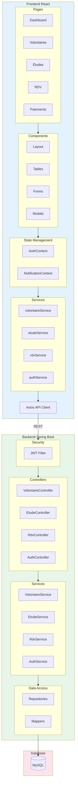

# Diagramme de Composants

```mermaid
flowchart TB
    subgraph Frontend["Frontend React"]
        subgraph Pages
            P1[Dashboard]
            P2[Volontaires]
            P3[Études]
            P4[RDV]
            P5[Paiements]
        end

        subgraph Components
            C1[Layout]
            C2[Tables]
            C3[Forms]
            C4[Modals]
        end

        subgraph State["State Management"]
            S1[AuthContext]
            S2[NotificationContext]
        end

        subgraph Services
            SV1[volontaireService]
            SV2[etudeService]
            SV3[rdvService]
            SV4[authService]
        end

        API[Axios API Client]
    end

    subgraph Backend["Backend Spring Boot"]
        subgraph Controllers
            CT1[VolontaireController]
            CT2[EtudeController]
            CT3[RdvController]
            CT4[AuthController]
        end

        subgraph BusinessServices["Services"]
            BS1[VolontaireService]
            BS2[EtudeService]
            BS3[RdvService]
            BS4[AuthService]
        end

        subgraph Security
            SEC[JWT Filter]
        end

        subgraph Data["Data Access"]
            R1[Repositories]
            M1[Mappers]
        end
    end

    subgraph Database
        DB[(MySQL)]
    end

    Pages --> Components
    Components --> State
    State --> Services
    Services --> API
    API -->|REST| Security
    Security --> Controllers
    Controllers --> BusinessServices
    BusinessServices --> Data
    Data --> DB

    style Frontend fill:#e3f2fd
    style Backend fill:#e8f5e9
    style Database fill:#fce4ec
```
