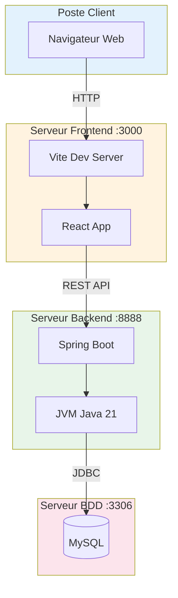

# Diagramme de Déploiement

```mermaid
flowchart TB
    subgraph Client["Poste Client"]
        Browser[Navigateur Web]
    end

    subgraph ServerFront["Serveur Frontend :3000"]
        Vite[Vite Dev Server]
        React[React App]
    end

    subgraph ServerBack["Serveur Backend :8888"]
        Spring[Spring Boot]
        JVM[JVM Java 21]
    end

    subgraph ServerDB["Serveur BDD :3306"]
        MySQL[(MySQL)]
    end

    Browser -->|HTTP| Vite
    Vite --> React
    React -->|REST API| Spring
    Spring --> JVM
    JVM -->|JDBC| MySQL

    style Client fill:#e3f2fd
    style ServerFront fill:#fff3e0
    style ServerBack fill:#e8f5e9
    style ServerDB fill:#fce4ec
```
