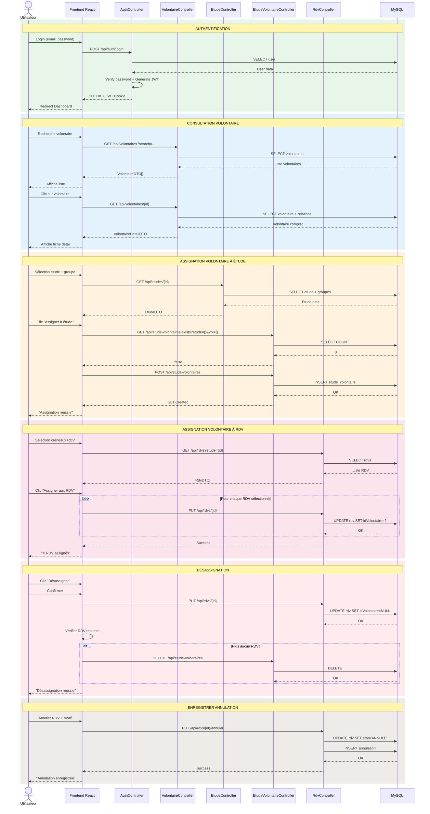

# Diagramme de Séquence - Flux Complet

```mermaid
sequenceDiagram
    actor U as Utilisateur
    participant F as Frontend React
    participant Auth as AuthController
    participant Vol as VolontaireController
    participant Etu as EtudeController
    participant EV as EtudeVolontaireController
    participant Rdv as RdvController
    participant DB as MySQL

    %% === AUTHENTIFICATION ===
    rect rgb(232, 245, 233)
        Note over U,DB: AUTHENTIFICATION
        U->>F: Login (email, password)
        F->>Auth: POST /api/auth/login
        Auth->>DB: SELECT user
        DB-->>Auth: User data
        Auth->>Auth: Verify password + Generate JWT
        Auth-->>F: 200 OK + JWT Cookie
        F-->>U: Redirect Dashboard
    end

    %% === CONSULTATION VOLONTAIRE ===
    rect rgb(227, 242, 253)
        Note over U,DB: CONSULTATION VOLONTAIRE
        U->>F: Recherche volontaire
        F->>Vol: GET /api/volontaires?search=...
        Vol->>DB: SELECT volontaires
        DB-->>Vol: Liste volontaires
        Vol-->>F: VolontaireDTO[]
        F-->>U: Affiche liste

        U->>F: Clic sur volontaire
        F->>Vol: GET /api/volontaires/{id}
        Vol->>DB: SELECT volontaire + relations
        DB-->>Vol: Volontaire complet
        Vol-->>F: VolontaireDetailDTO
        F-->>U: Affiche fiche détail
    end

    %% === ASSIGNATION ÉTUDE ===
    rect rgb(255, 243, 224)
        Note over U,DB: ASSIGNATION VOLONTAIRE À ÉTUDE
        U->>F: Sélection étude + groupe
        F->>Etu: GET /api/etudes/{id}
        Etu->>DB: SELECT etude + groupes
        DB-->>Etu: Etude data
        Etu-->>F: EtudeDTO

        U->>F: Clic "Assigner à étude"
        F->>EV: GET /api/etude-volontaires/exists?etude={}&vol={}
        EV->>DB: SELECT COUNT
        DB-->>EV: 0
        EV-->>F: false

        F->>EV: POST /api/etude-volontaires
        EV->>DB: INSERT etude_volontaire
        DB-->>EV: OK
        EV-->>F: 201 Created
        F-->>U: "Assignation réussie"
    end

    %% === ASSIGNATION RDV ===
    rect rgb(252, 228, 236)
        Note over U,DB: ASSIGNATION VOLONTAIRE À RDV
        U->>F: Sélection créneaux RDV
        F->>Rdv: GET /api/rdvs?etude={id}
        Rdv->>DB: SELECT rdvs
        DB-->>Rdv: Liste RDV
        Rdv-->>F: RdvDTO[]

        U->>F: Clic "Assigner aux RDV"

        loop Pour chaque RDV sélectionné
            F->>Rdv: PUT /api/rdvs/{id}
            Rdv->>DB: UPDATE rdv SET idVolontaire=?
            DB-->>Rdv: OK
        end

        Rdv-->>F: Success
        F-->>U: "X RDV assignés"
    end

    %% === DÉSASSIGNATION ===
    rect rgb(255, 235, 238)
        Note over U,DB: DÉSASSIGNATION
        U->>F: Clic "Désassigner"
        U->>F: Confirmer

        F->>Rdv: PUT /api/rdvs/{id}
        Rdv->>DB: UPDATE rdv SET idVolontaire=NULL
        DB-->>Rdv: OK

        F->>F: Vérifier RDV restants

        alt Plus aucun RDV
            F->>EV: DELETE /api/etude-volontaires
            EV->>DB: DELETE
            DB-->>EV: OK
        end

        F-->>U: "Désassignation réussie"
    end

    %% === ANNULATION ===
    rect rgb(239, 235, 233)
        Note over U,DB: ENREGISTRER ANNULATION
        U->>F: Annuler RDV + motif
        F->>Rdv: PUT /api/rdvs/{id}/annuler
        Rdv->>DB: UPDATE rdv SET etat='ANNULE'
        Rdv->>DB: INSERT annulation
        DB-->>Rdv: OK
        Rdv-->>F: Success
        F-->>U: "Annulation enregistrée"
    end
```
