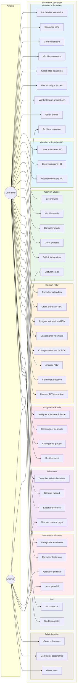

# Diagramme de Cas d'Utilisation - Complet

```mermaid
flowchart LR
    subgraph Acteurs
        USER((Utilisateur))
        ADMIN((Admin))
    end

    subgraph Systeme["Système Cosmetest"]

        subgraph GestionVolontaires["Gestion Volontaires"]
            UV1[Rechercher volontaire]
            UV2[Consulter fiche]
            UV3[Créer volontaire]
            UV4[Modifier volontaire]
            UV5[Archiver volontaire]
            UV6[Gérer infos bancaires]
            UV7[Voir historique études]
            UV8[Voir historique annulations]
            UV9[Gérer photos]
        end

        subgraph GestionVolontairesHc["Gestion Volontaires HC"]
            UVH1[Lister volontaires HC]
            UVH2[Créer volontaire HC]
            UVH3[Modifier volontaire HC]
        end

        subgraph GestionEtudes["Gestion Études"]
            UE1[Créer étude]
            UE2[Modifier étude]
            UE3[Consulter étude]
            UE4[Clôturer étude]
            UE5[Gérer groupes]
            UE6[Définir indemnités]
        end

        subgraph GestionRDV["Gestion RDV"]
            UR1[Consulter calendrier]
            UR2[Créer créneaux RDV]
            UR3[Assigner volontaire à RDV]
            UR4[Désassigner volontaire]
            UR5[Changer volontaire de RDV]
            UR6[Annuler RDV]
            UR7[Confirmer présence]
            UR8[Marquer RDV complété]
        end

        subgraph AssignationEtude["Assignation Étude"]
            UA1[Assigner volontaire à étude]
            UA2[Désassigner de étude]
            UA3[Changer de groupe]
            UA4[Modifier statut]
        end

        subgraph GestionAnnulations["Gestion Annulations"]
            UAN1[Enregistrer annulation]
            UAN2[Consulter historique]
            UAN3[Appliquer pénalité]
            UAN4[Lever pénalité]
        end

        subgraph Paiements["Paiements"]
            UP1[Consulter indemnités dues]
            UP2[Générer rapport]
            UP3[Exporter données]
            UP4[Marquer comme payé]
        end

        subgraph Administration["Administration"]
            UAD1[Gérer utilisateurs]
            UAD2[Configurer paramètres]
            UAD3[Gérer rôles]
        end

        subgraph Authentification["Auth"]
            UAUTH1[Se connecter]
            UAUTH2[Se déconnecter]
        end

    end

    USER --> UV1 & UV2 & UV3 & UV4 & UV6 & UV7 & UV8 & UV9
    USER --> UVH1 & UVH2 & UVH3
    USER --> UE1 & UE2 & UE3 & UE5 & UE6
    USER --> UR1 & UR2 & UR3 & UR4 & UR5 & UR6 & UR7 & UR8
    USER --> UA1 & UA2 & UA3 & UA4
    USER --> UAN1 & UAN2
    USER --> UP1 & UP2 & UP3
    USER --> UAUTH1 & UAUTH2

    ADMIN --> UV5
    ADMIN --> UE4
    ADMIN --> UAN3 & UAN4
    ADMIN --> UP4
    ADMIN --> UAD1 & UAD2 & UAD3

    style Systeme fill:#f9f9f9
    style GestionVolontaires fill:#e3f2fd
    style GestionVolontairesHc fill:#e1f5fe
    style GestionEtudes fill:#e8f5e9
    style GestionRDV fill:#fff3e0
    style AssignationEtude fill:#fce4ec
    style GestionAnnulations fill:#ffebee
    style Paiements fill:#f3e5f5
    style Administration fill:#efebe9
    style Authentification fill:#eceff1
```
